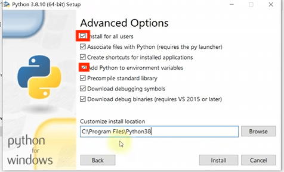

# 💬 Chatbot template

A simple Streamlit app that shows how to build a chatbot using OpenAI's GPT-3.5.

[](https://chatbot-template.streamlit.app/)

### How to run it on your own machine

### Installation Guide

1. **Prerequisites Installation**
- Download all files from the repository and save them in a single folder.
- Open the folder in Visual Studio Code.
- Install either Python 3.12 or Python 3.14.
- (1). Download Python
- &emsp;Visit the Python official website (https://www.python.org/downloads/windows/) download page.
- &emsp;Select the latest version (such as Python 3.12.x), and click Download Windows Installer (64-bit/32-bit).
- &emsp;Run the installer<br>

- (2). Double-click the downloaded .exe file.
- &emsp;Check Add Python to PATH (important! Otherwise, you need to manually configure the environment variables).<br>

- &emsp;Click Install Now (default installation) or customize the installation path.
- &emsp;Check the first and fourth options. The first option is to install to all users. The fourth option is to install environment variables.<br>

- (3). Verify the installation
- &emsp;Open the command prompt (Win + R → enter cmd),Run:
```
python --version
```
- &emsp;If the version number is displayed (such as Python 3.12.0), the installation is successful.

<! -- The above modifications were made through 2205308040320--><br> 


2. **Environment Configuration**
- Navigate to System Properties → Environment Variables.
- Edit the system PATH variable and add a new entry:
```
[Your Python installation path]\Python\Scripts
```
- Configure Visual Studio Code to use the installed Python interpreter.

3. **Dependencies Installation**
- Open Command Prompt (Windows+R → type `cmd`).
- Navigate to your project folder and run:
```
pip install -r requirements.txt
```
- *Note: If you encounter download issues, you may need to use alternative network solutions.*

### Running the Application

1. Launch `streamlit_mapp.py` in Visual Studio Code.
2. Access your chatbot's GitHub repository interface.<br>

3. Enter your pre-set password to start chatting with the chatbot.<br>

   
*Note: Service availability may be limited in certain regions.*
<br>
<! -- The above modifications were made through 2205308040301-->
  
### Detailed Function Description and Implementation Analysis of the Module
 
 Interface initialization and user guidance

• Interface title and description: Use the st.title() and st.write() functions to display the title and description of the chatbot respectively, and introduce to users that this is a simple chatbot based on the OpenAI GPT-3.5 model, and need to provide O The penAI API key can only be used.

• Get the API key: st.text_input() creates a secure text input box, requiring the user to enter the OpenAI API key, and the input content will be hidden in the form of a password to protect the user‘s key security.
### Code demonstration
```import streamlit as st

# Show title and description
st.title("Chatbot")
st.write(
    "This is a simple chatbot that uses OpenAI's GPT-3.5 model to generate responses. "
    "To use this app, you need to provide an OpenAI API key, which you can get [here](https://platform.openai.com/account/api-keys). "
    "You can also learn how to build this app step by step by [following our tutorial](https://docs.streamlit.io/develop/tutorials/llms/build-conversational-apps)."
)
```
User input verification and interface logic

• API key verification: determine whether the user has entered the API key through the if not openai_api_key: condition. If there is no input, use st.info() to display prompts to tell users that they need to add an API key to continue.

• Chat interface placeholding: If the user provides a valid API key, use the pass statement to reserve the location, indicating that after the user provides the API key, the subsequent chat logic of interaction with OpenAI API has not been implemented and needs to be further developed.
### Code demonstration
```# Request the user to input the OpenAI API key via a text input box
openai_api_key = st.text_input("OpenAI API Key", type="password")
if not openai_api_key:
    st.info("Please add your OpenAI API key to continue.", icon="")
else:
    # If the API key exists, proceed to display the chat interface
    # This is a placeholder for the subsequent chat logic
    pass
```
